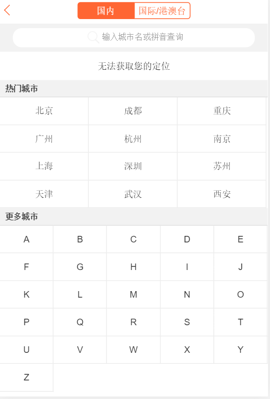
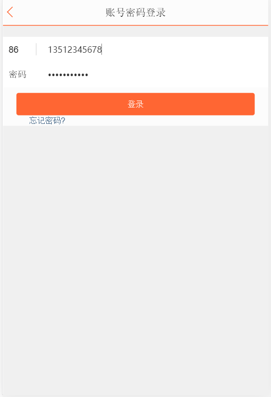
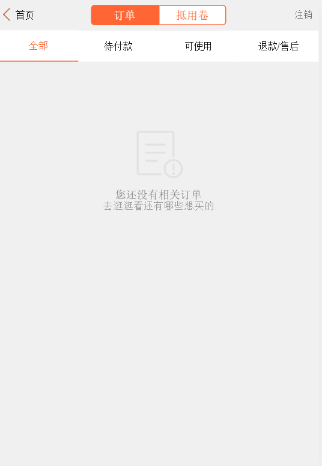
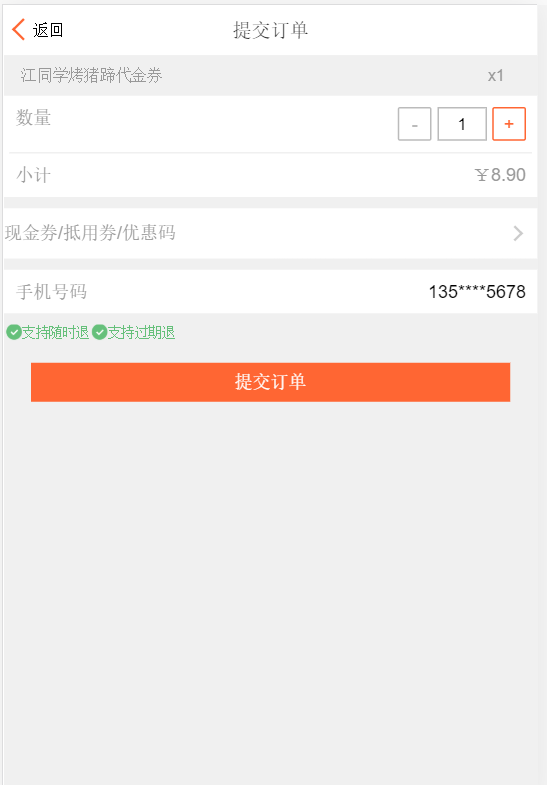
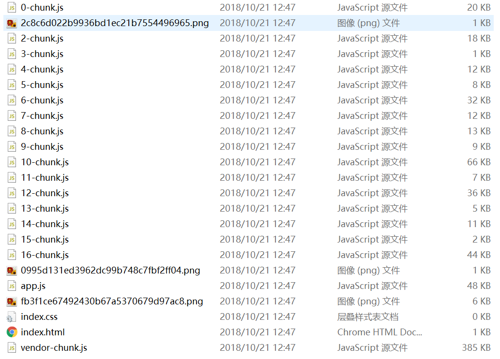

# 大众点评 WebApp(React技术栈实现)

将大众点评主要的一些页面都实现了,使用webpack-dev-server模拟了登录功能

用到的技术栈有:

- react-router:路由跳转
- redux-saga:异步处理
- styled-jsx:css-in-js
- mockjs:mock数据
- axios:发起request

## 成品演示

### 主页

### 城市页

### 商品详情页

### 登录页

### 个人主页

### 提交订单页面

### 店家详情页

### mock评论数据

### 按需加载效果

